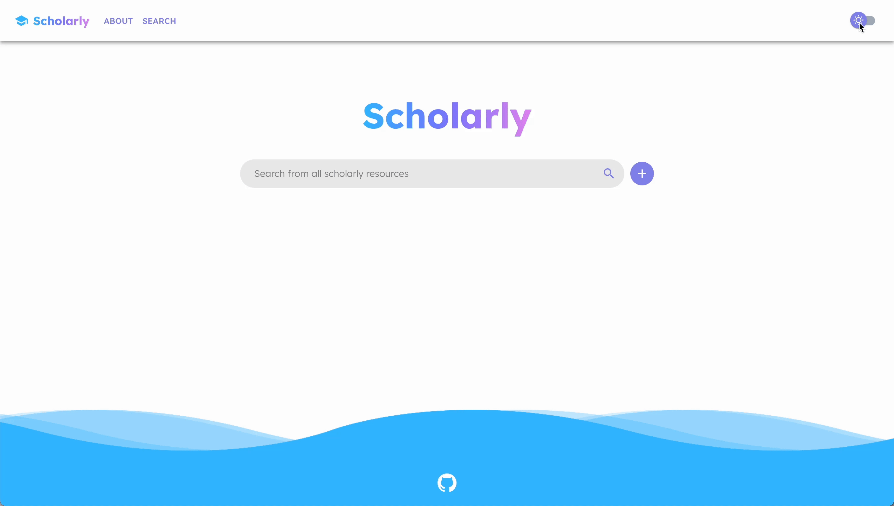
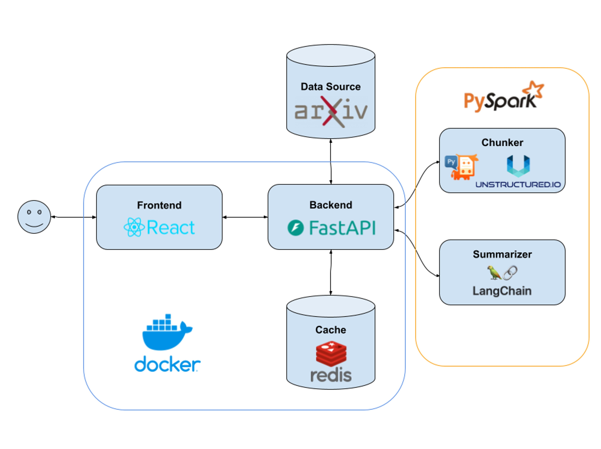
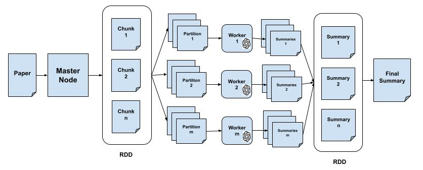

# Scholarly

Scholarly is a web application that assists researchers in conducting literature reviews by providing detailed summaries of papers relevant to their search queries. It’s intended to demonstrate the use of [Apache Spark](https://en.wikipedia.org/wiki/Apache_Spark), a big data tool that can process large datasets in parallel by distributing tasks across a cluster of computers. In this way, Spark enables us to process large amounts of data more efficiently than we can on a single compute. 

## Table of Contents
- [Usage](#usage)
- [Features](#features)
- [Tech Stack](#tech-stack)
- [Summary Process](#summary-process)
- [Contributors](#contributors)

## Usage

1. Make sure to have `Python 3.10` and `Docker` installed on your local machine  
2. Clone the repository: `git clone https://github.com/allan-jt/Scholarly.git`  
3. Go into the `src` directory: `cd Scholarly/src`  
4. Create an `.env` file following the structure of `.env.example` and insert your OpenAI API Key  
5. Go into the root directory (`cd Scholarly`)   
6. Enter `make all` in the terminal to start the project
7. Access the web app at `http://localhost:5173/`

Note: The `.env.example` configures Spark to simulate a cluster of computers using the local machine's processes since a real cluster wasn't available to us. Consequently, summarizing a paper is relatively slow.

## Features

A bottleneck in research is the literature review, as it requires sifting through numerous papers to understand their key findings and results. This time-consuming process is necessary for formulating hypotheses and designing experiments. Scholarly aims to streamline this process by providing researchers with concise yet detailed summaries of relevant papers. To achieve this, we implemented the following features: 

#### Search: Enter query keywords to quickly find related papers

#### Advanced Search: Use filters like publication date, sorting order, and abstract keywords to filter results

#### Summarize: Click on a paper to generate a concise summary by section

#### Re-summarize: Cache summaries for instant, future access without reprocessing

#### Dark Mode: Switch to dark mode for improved visibility and reduced eye strain

#### Pagination: Navigate through large sets of results with pagination controls

## Tech Stack

- **React (with Vite):** A frontend framework using TypeScript  
- **FastAPI:** A Python-based backend framework designed for high performance  
- **Redis:** A caching layer for storing and quickly retrieving paper summaries  
- **Docker:** Used for containerizing the frontend, backend, and database to ensure consistency across environments  
- **Arxiv:** An external database used to retrieve research papers via API calls  
- **PySpark:** A Python client for interfacing with Apache Spark for distributed data processing  
- **Unstructured.io:** A python library for chunking research papers by sections to facilitate efficient processing  
- **LangChain (using GPT-4):** A framework we use with gpt-4o-mini for summarizing individual chunks of research papers

## Summary Process

A typical research paper, averaging around 10,000 tokens, often exceeds the context windows of many LLMs (e.g., 2,048 tokens for GPT-3 and 8,192 tokens for GPT-4). Even when context windows are sufficiently large to process entire papers, the resulting summaries often lack the depth and detail achievable by focusing on specific sections. To address these, we implemented a [MapReduce](https://en.wikipedia.org/wiki/MapReduce)\-style process using Spark and LangChain. The approach involves splitting the paper into sections, summarizing them in parallel, and then collating the results for a comprehensive and detailed summary.

#### Workflow explanation

1. **Chunking:** The selected paper is first chunked by section, using Unstructured IO to parse the PDF from arxiv. For a minority of cases, however, this fails owing to the difficulties of parsing PDFs. In such cases, the paper is chunked in blocks of 10,000 characters.  
2. **RDD Creation:** The resulting array of chunks is converted into a Resilient Distributed Dataset (RDD), PySpark’s core data structure for distributed computing.  
3. **MapReduce Architecture:** Spark consists of a master node and worker nodes, where the former allocates tasks to the workers (map) for independent processing. Once the workers have completed their tasks, the master node aggregates the results (reduce) for final processing. Worker nodes are typically separate machines in a cluster. But for demonstration purposes and due to limited access, the worker nodes are simulated using the processes of a local machine.  
4. **Partitioning the Chunks (map):** The chunks from the RDD are grouped into a smaller number of partitions, where each is assigned to a worker.  
5. **Processing on Worker Nodes:** The worker nodes process the chunk in their partition sequentially. The [LangChain summarization process](https://python.langchain.com/docs/tutorials/summarization/), instantiated on each node, handles the generation of summaries for individual chunks.  
6. **Handling Large Sections:** If a chunked section is too large for the context window, it is further divided into sub-chunks. These sub-chunks are summarized in parallel within the same worker node using LangChain’s threading capabilities, ensuring even the largest sections are handled effectively.  
7. **Collecting and Combining Summaries (reduce):** Once all the worker nodes complete their assigned tasks, the generated summaries are collected by the master node. These summaries are then combined into a final comprehensive summary, which is delivered to the user.

## Contributors
- Timothy Cao
- Chase Huang
- Ahhyun Moon
- Allan Thekkepeedika
